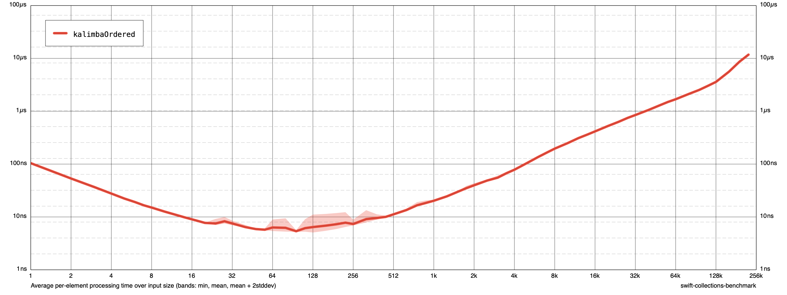
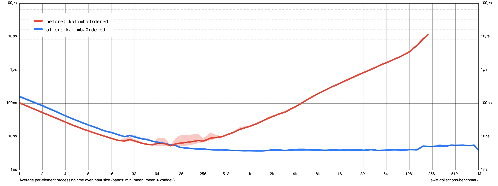

# Getting Started with `CollectionsBenchmark`

Let's say we're working on adding a hypothetical new sequence algorithm that reorders elements by adding them into a new collection, alternating between inserting at the start and end position. This resembles the way musical notes are arranged on a typical [kalimba] (or mbira), so let's call this ["kalimba-ordering"][kalimbaOrdered]:

[kalimba]: https://en.wikipedia.org/wiki/Mbira
[kalimbaOrdered]: https://github.com/apple/swift-collections/blob/main/Benchmarks/Benchmarks/Kalimba.swift#L15-L28

```swift
extension Sequence {
  func kalimbaOrdered() -> [Element] {
    var kalimba: [Element] = []
    kalimba.reserveCapacity(underestimatedCount)
    var insertAtStart = false
    for element in self {
      if insertAtStart {
        kalimba.insert(element, at: 0)
      } else {
        kalimba.append(element)
      }
      insertAtStart.toggle()
    }
    return kalimba
  }
}
```

Assuming there is a use case for such an algorithm, how would be go about measuring the performance of this implementation? We can do some algorithm analysis to determine that its asymptotic running time is [Θ(*n*²)](https://en.wikipedia.org/wiki/Big_O_notation), where *n* is the number of items in the original sequence -- inserting to the front of an array takes linear time, so inserting *n*/2 items one by one will take quadratic time. But how does this map to actual performance on a real machine? How long does it take to kalimba-order ten items? A hundred? A million? At what count will this implementation become impractical?

This is where this package comes in -- it lets us easily create, run, and analyze benchmarks for any algorithm that can be measured over a range of input sizes.

### Defining Benchmarks

The `CollectionsBenchmark` library makes it easy to add an executable target for running, collecting, visualizing, and comparing benchmarks from the command line.
To create a benchmark CLI tool, create a main.swift file and within it:

1. Import `CollectionsBenchmark`.
2. Create a `Benchmark` instance with an appropriate title.
3. Add a benchmark to this instance using the `addSimple` method to configure the benchmark with a closure to execute.
4. Invoke `benchmark.main()` to use the library's CLI features.

The following example illustrates creating a benchamrk, included as [`main.swift`](./Example/Sources/kalimba-benchmark/main.swift) in the [`Documentation/Example` directory](./Example) of this project:

```swift
import CollectionsBenchmark

// Create a new benchmark instance.
var benchmark = Benchmark(title: "Kalimba")

// Define a very simple benchmark called `kalimbaOrdered`.
benchmark.addSimple(
  title: "kalimbaOrdered",
  input: [Int].self
) { input in
  blackHole(input.kalimbaOrdered())
}

// Execute the benchmark tool with the above definitions.
benchmark.main()
```

The benchmark definition above has a title, an input type specification, and a closure to execute it. In this case, our `kalimbaOrdered` benchmark uses an array of integers as its input (populated by randomly shuffling integers in the range `0..<size`, where `size` varies between executions). On every run, it reorders its input into kalimba order, and feeds the result to the special `blackHole` function. This function does nothing, discarding its input -- but it does this in a way that prevents the Swift compiler from realizing that the result isn't actually used. (Otherwise, the compiler may helpfully eliminate the entire calculation, defeating the entire purpose of running the benchmark!)

That's all we needed to write -- we now have a helpful benchmark utility that we can run from the command line. It uses the [Swift Argument Parser] to provide a friendly interface, with lots of interesting commands and a rich set of options, complete with `--help` for each.

[Swift Argument Parser]: https://github.com/apple/swift-argument-parser

### Running Benchmarks

Here is how we can use this tool to run our benchmark, collecting data into a file called `results`. By default, the tool measures execution time for sizes between 1 and and 1,000,000.

```shellsession
$ swift run -c release kalimba-benchmark run --cycles 3 results
Running 1 tasks on 76 sizes from 1 to 1M:
  kalimbaOrdered
Output file: /Users/klorentey/Projects/swift-collections-benchmark-demo/results
Appending to existing data (if any) for these tasks/sizes.

Collecting data:
  1.2.4...8...16...32...64...128...256...512...1k...2k...4k...8k...16k...32k...64k...128k...256k...512k...1M -- 21.7s
  1.2.4...8...16...32...64...128...256...512...1k...2k...4k...8k...16k...32k...64k...128k...256k...512k...1M -- 21.7s
  1.2.4...8...16...32...64...128...256...512...1k...2k...4k...8k...16k...32k...64k...128k...256k...512k...1M -- 21.8s
Finished in 65.2s
$
```

The `--cycles` option specifies the number of times we want the tool to cycle through the sizes. (By default, the tool never stops -- if you decide you have enough data, press Control-C to terminate it.) 

If it takes too long to run the benchmarks, feel free to stop them at any point -- the results are regularly saved, so you won't lose progress. It is also fine to collect more data later by re-executing the same command -- by default, it adds data to the existing results, rather than overwriting them. (Although you can control this behavior with the `--mode` option.)

Be sure to explore the `--help` output to get to know what you can control! (There are so many options...)

### Visualizing Results

The generated `results` file is text file in a simple JSON format, containing all the data you collected. This is useful for machines, but unfortunately it's pretty hard for a human to analyze data in this form -- so we need to visualize it somehow. Luckily, there is a command for that:

```shellsession
$ swift run -c release kalimba-benchmark render results chart.png
$ open chart.png
```

(If you are using Linux, you may need to replace `png` with `svg` -- you'll get the same charts, only in a different format!)

Here is how the resulting graph looks with the results we've just collected:



By default, the tool generates log-log charts showing the average processing time spent on each individual input item. These may look weird at first, but I find this format produces the most useful overview of the underlying data.

The chart shows that the average time spent on each element initially starts high, then goes down until the input size reaches a certain size. This is pretty typical -- it means that there is some sort of constant(ish) overhead (allocation costs, etc.) that is a significant component of the overall runtime at small sizes, but its cost gradually becomes insignificant as we have more elements to process.

For input counts above 256 elements or so, our `kalimbaOrdered` curve looks like a straight(ish) line, roughly doubling in time every time we double the input size -- this slope indicates that the per-element execution time is linear, which means that the overall time to process all items is quadratic. So we've confirmed our original estimate.

Weirdly, the curve stops short before the input reaches a quarter million elements. This is by design! When a benchmark's per-element execution time crosses a predefined limit, the tool stops running that particular benchmark on any larger size, to prevent quadratic benchmarks from holding up results -- otherwise the benchmark could take hours or even multiple days/weeks to complete. The threshold is set to 10µs by default, which seems to be a pretty good cutoff for microbenchmarks. However, if you need to go higher (or lower), you can use the `run` command's `--amortized-cutoff` option to set your own limit, or use `--disable-cutoff` to disable it altogether.

The `render` command also comes with its own options that lets you control chart formatting -- check out its `--help`! You'll find options to switch to linear scales (`--linear-size`, `--linear-time`), show the full execution time instead of the per-element value (`--amortized false`), ignore outliers above a certain percentile (`--percentile 90`), control the ranges shown (`--min-time 10ns`, `--max-size 2M`), etc. etc. There are so many things to tweak!

### Comparing Results

Often, the reason we run benchmarks is because we have an idea for a potential optimization, and we want to know if it leads to an actual improvement. Swift Collections Benchmarks provides specialized tools to make this super simple!

For example, I think the reason our `kalimbaOrdered` implementation is so slow is because it keeps inserting elements to the front of a growing array -- a linear operation. We can fix that by switching to another data structure -- for example, I have a feeling `Deque` from the [Swift Collections] package would work wonders here. Let's try it: all we need is to import Collections and replace `Array` with `Deque`:

[Swift Collections]: https://github.com/apple/swift-collections

```swift
import Collections

extension Sequence {
  func kalimbaOrdered() -> Deque<Element> {
    var kalimba: Deque<Element> = []
    kalimba.reserveCapacity(underestimatedCount)
    var insertAtStart = false
    for element in self {
      if insertAtStart {
        kalimba.prepend(element)
      } else {
        kalimba.append(element)
      }
      insertAtStart.toggle()
    }
    return kalimba
  }
}
```

I can easily confirm that this will be faster by re-running the benchmarks. I'm careful to use a new output file, though -- I don't want the new results to get mixed in with the old:

```shellsession
$ swift run -c release kalimba-benchmark run --cycles 3 results-deque
Running 1 tasks on 76 sizes from 1 to 1M:
  kalimbaOrdered
Output file: /Users/klorentey/Projects/swift-collections-benchmark-demo/results-deque
Appending to existing data (if any) for these tasks/sizes.

Collecting data:
  1.2.4...8...16...32...64...128...256...512...1k...2k...4k...8k...16k...32k...64k...128k...256k...512k...1M -- 1.37s
  1.2.4...8...16...32...64...128...256...512...1k...2k...4k...8k...16k...32k...64k...128k...256k...512k...1M -- 1.38s
  1.2.4...8...16...32...64...128...256...512...1k...2k...4k...8k...16k...32k...64k...128k...256k...512k...1M -- 1.37s
Finished in 4.12s
```

Well this is already quite promising -- it ran in less than five seconds, while the original took more than a full minute!

For a more detailed differential analysis, we can ask the tool to compare two benchmark results:

```shellsession
$ swift run -c release kalimba-benchmark results compare results results-deque
Tasks with difference scores larger than 1.05:
  Score   Sum     Improvements Regressions  Name
  162.8   162.8   162.9(#44)   0.9048(#23)  kalimbaOrdered (*)
```

The scores are various measures of how much of a difference the tool registered between the two results. In this case, it tells us that the second set of results are a whopping 162.8 times faster on average than the first. That's pretty good! It's not all roses, though: while 44 sizes were dramatically improved, there were 23 sizes where `Deque` measured ~10% slower.

To take a closer look, let's produce a graphical rendering:

```shellsession
$ swift run -c release kalimba-benchmark results compare results results-deque --output diff.html
Tasks with difference scores larger than 1.05:
  Score   Sum     Improvements Regressions  Name
  162.8   162.8   162.9(#44)   0.9048(#23)  kalimbaOrdered (*)
1 images written to diff.html
$ open diff.html
```

> #### Benchmark differentials
> 
> 1. kalimbaOrdered (score: 162.8, overall: 162.8, improvements: 162.9(#44), regressions: 0.9048(#23))
> 
> 

Well that still looks like a great optimization to me -- `Array` is slightly faster at small sizes, but as the data grows, it cannot keep up with `Deque` at all. (By the way, I'm pretty sure that initial 10% difference will be reduced as the Collections package improves! `Array` has already received more than half a decade's worth of performance work, but work on `Deque` is just getting started. 😉)

The `results compare` command gets even more powerful once we have more than one benchmark. It is invaluable for getting us an objective (dare I say, ruthless) measure of how a potential change affects performance for our collection implementations.

### Benchmark Libraries

If you're anything like me, once you get the hang of writing benchmarks, it's difficult to stop. For example, the `Collections` package has several hundred (and counting!) benchmark definitions, each capturing a different aspect of data structure behavior.

With so many benchmarks, we need a way to organize them into a series of thematic charts that make sense -- trying to render them all on a single chart makes for interesting glitch art, but it isn't very practical:


Here is where benchmark libraries come in! They allow us to maintain a collection of interesting charts, organized into hierarchical sections, with nice descriptive titles. Once we have defined a library, we can easily re-run the specific benchmarks it contains, and render the result in a nice document. We don't need to keep track of what combinations of tasks make the most useful charts, or to remember to run every task we're going to need -- the library takes care of administering these details.

Benchmark libraries are JSON text files, containing serialized [`ChartLibrary`](https://github.com/apple/swift-collections-benchmark/blob/main/Sources/CollectionsBenchmark/Benchmark/Benchmark%2BChartLibrary.swift) instances. A production example is [the chart library that comes with the Collections package](https://github.com/apple/swift-collections/blob/main/Benchmarks/Benchmarks/Library.json).

For example, here is a snippet from [the small chart library][announcement-library] that we used to generate the benchmarking charts in the [Swift Collections announcement blog post][announcement]:

[announcement-library]: https://github.com/apple/swift-collections/tree/main/Documentation/Announcement-benchmarks
[announcement]: https://swift.org/blog/swift-collections

```json
{
  "kind": "group",
  "title": "All results",
  "directory": "Results",
  "contents": [
    {
      "kind": "chart",
      "title": "Deque: random access lookups",
      "tasks": [
        "Deque<Int> subscript get, random offsets (discontiguous)",
        "Array<Int> subscript get, random offsets",
        "std::deque<intptr_t> at, random offsets",
      ]
    },
    {
      "kind": "chart",
      "title": "Deque: prepending individual integers",
      "tasks": [
        "Deque<Int> prepend, reserving capacity",
        "Array<Int> prepend, reserving capacity",
        "std::deque<intptr_t> push_front",
      ]
    },
    ...
}
```

Use the `library run` and `library render` commands to collect data and to render the library:

```shellsession
$ swift-collections-benchmark library run results.json --library Library.json --max-size 16M --cycles 20
$ swift-collections-benchmark library render results.json --library Library.json --max-time 10us --min-time 1ns --theme-file Theme.json --percentile 90 --output .
```

With these arguments, the result is an interactive Markdown file that links to standalone image files: (but you can also replace `--output .` with `--output results.html` to get a self-contained HTML file that you can share with your friends and family.

> #### Benchmark results
>
> Click to expand individual items below.
> <details open>
>   <summary><strong>All results</strong></summary>
>   <ul>
>   <details>
>     <summary>01: Deque: random access lookups</summary>
>     
>   </details>
>   <details>
>     <summary>02: Deque: prepending individual integers</summary>
>     
>   </details>
>   <details>
>     <summary>03: OrderedSet lookups</summary>
>     
>   </details>
>   <details>
>     <summary>04: OrderedSet insertions</summary>
>     
>   </details>
>   <details>
>     <summary>05: OrderedDictionary lookups</summary>
>     
>   </details>
>   <details>
>     <summary>06: OrderedDictionary insertions</summary>
>     
>   </details>
>   </ul>
> </details>

That's plenty of information to start with. Thanks for reading this -- now go and run some benchmarks!
