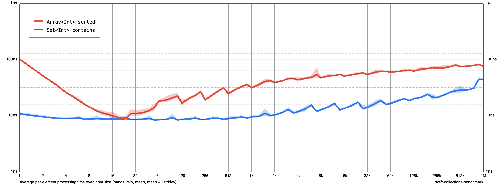

# Benchmarking Support for [Swift Collections]

[](https://swiftpackageindex.com/apple/swift-collections-benchmark)
[](https://swiftpackageindex.com/apple/swift-collections-benchmark)

This package lets you collect and easily visualize performance data about data structure implementations and collection algorithms. It was created to help develop the [Swift Collections] package, but it's useful for so much more!

[Swift Collections]: https://github.com/apple/swift-collections

This project primarily concentrates on benchmarking Swift code, but it can also be used to run benchmarks (and, especially, to analyze benchmark results) in other languages, too.

## Example

Here is a short benchmark, measuring the performance of `Array.sorted()` and `Set.contains(_:)`:

``` swift
import CollectionsBenchmark

var benchmark = Benchmark(title: "Demo Benchmark")

benchmark.addSimple(
  title: "Array<Int> sorted",
  input: [Int].self
) { input in
  blackHole(input.sorted())
}

benchmark.add(
  title: "Set<Int> contains",
  input: ([Int], [Int]).self
) { input, lookups in
  let set = Set(input)
  return { timer in
    for value in lookups {
      precondition(set.contains(value))
    }
  }
}

benchmark.main()
```

Here is how you run it:

``` shellsession
$ swift run -c release benchmark run results --cycles 5
Running 2 tasks on 76 sizes from 1 to 1M:
  Array<Int> sorted
  Set<Int> contains
Output file: /Users/klorentey/Projects/swift-collections-benchmark-demo/Demo/results
Appending to existing data (if any) for these tasks/sizes.

Collecting data:
  1.2.4...8...16...32...64...128...256...512...1k...2k...4k...8k...16k...32k...64k...128k...256k...512k...1M -- 5.31s
  1.2.4...8...16...32...64...128...256...512...1k...2k...4k...8k...16k...32k...64k...128k...256k...512k...1M -- 5.35s
  1.2.4...8...16...32...64...128...256...512...1k...2k...4k...8k...16k...32k...64k...128k...256k...512k...1M -- 5.29s
  1.2.4...8...16...32...64...128...256...512...1k...2k...4k...8k...16k...32k...64k...128k...256k...512k...1M -- 5.3s
  1.2.4...8...16...32...64...128...256...512...1k...2k...4k...8k...16k...32k...64k...128k...256k...512k...1M -- 5.34s
Finished in 26.6s
$ swift run -c release benchmark render results chart.png
$ open chart.png
```

And this is what you get:



Today I learned that sorting 20 integers in an `Array` takes about as much time as looking at all items in a 20-member `Set`. Fascinating! 🤓

## Documentation

For a tour of the features provided by this library, please be sure check out our [Getting Started Guide][guide]!

[guide]: Documentation/01%20Getting%20Started.md

## Project status

This package is intended primarily to be a developer tool, rather than something that would be used in production apps.

This package is not source stable; its API surface, its command line interface, and the format/contents of the files it generates is subject to change between tags, sometimes in ways that breaks clients that were written for previous releases.

## Adding this package as a dependency

To use this package in a SwiftPM project, add the following line to the dependencies in your `Package.swift` file:

```swift
.package(url: "https://github.com/apple/swift-collections-benchmark", from: "0.0.4"),
```

In the typical case, you'll want to set up a standalone executable target that is dedicated to benchmarking:

```swift
// swift-tools-version:6.1
import PackageDescription

let package = Package(
  name: "MyPackage",
  products: [
    .executable(name: "my-benchmark", targets: ["MyBenchmark"]),
  ],
  dependencies: [
    .package(url: "https://github.com/apple/swift-collections-benchmark", from: "0.0.1"),
    // ... other dependencies ...
  ],
  targets: [
    // ... other targets ...
    .target(
      name: "MyBenchmark",
      dependencies: [
        .product(name: "CollectionsBenchmark", package: "swift-collections-benchmark"),
      ]),
  ]
)
```

## Contributing to this package

### Asking questions

We can use the [Swift Collections Forum][forum] to ask and answer questions on how to use or work on this package. It's also a great place to discuss its evolution.

[forum]: https://forums.swift.org/c/related-projects/collections

### Reporting a bug

If you find something that looks like a bug, please open a [Bug Report][bugreport]! Fill out as many details as you can.

[bugreport]: https://github.com/apple/swift-collections-benchmark/issues/new?assignees=&labels=bug&template=BUG_REPORT.md

### Fixing a bug

1. [Submit a PR][PR] with your change. If there is an [existing issue][issues] for the bug you're fixing, please include a reference to it.
2. Make sure to add test coverage for whatever changes you are making (if possible).

[PR]: https://github.com/apple/swift-collections-benchmark/compare
[issues]: https://github.com/apple/swift-collections-benchmark/issues

(Note: The package doesn't currently come with many tests, reflecting its origins as a supporting project -- we strive to improve that!)

### Proposing an enhancement

1. Raise a [Feature Request][enhancement]. Discuss why it would be important to implement it.
2. Submit a PR with your implementation, participate in the review discussion.
3. When there is a consensus that the feature is desirable, and the implementation works well, it will be merged. 
4. Rejoice!

[enhancement]: https://github.com/apple/swift-collections-benchmark/issues/new?assignees=&labels=enhancement&template=FEATURE_REQUEST.md

### Licensing

By submitting a pull request, you represent that you have the right to license your contribution to Apple and the community, and agree by submitting the patch that your contributions are licensed under the [Swift License](https://swift.org/LICENSE.txt), a copy of which is [provided in this repository](LICENSE.txt).

### Code of Conduct

Like all Swift.org projects, we would like this package to foster a diverse and friendly community. We expect contributors to adhere to the [Swift.org Code of Conduct](https://swift.org/code-of-conduct/). A copy of this document is [available in this repository][coc].

[coc]: CODE_OF_CONDUCT.md

### Contacting the maintainers

The current code owner of this package is Karoy Lorentey ([@lorentey](https://github.com/lorentey)). You can contact him [on the Swift forums](https://forums.swift.org/u/lorentey/summary), or by writing an email to klorentey at apple dot com. (Please keep it related to this project.)

In case of moderation issues, you can also directly contact a member of the [Swift Core Team](https://swift.org/community/#community-structure).

